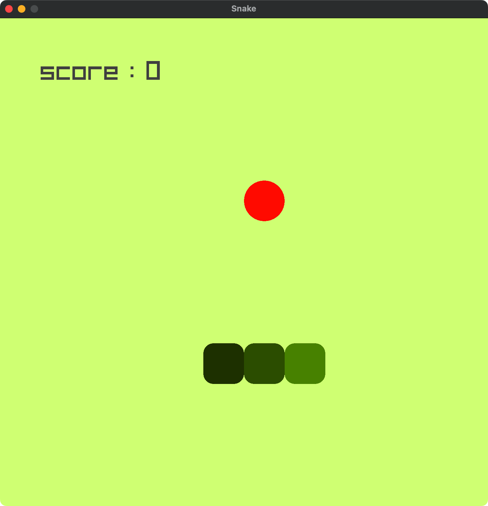

# Snake Game

Simple classic Snake game implementation  using the [raylib](https://www.raylib.com/) library.

## Screenshot



## Getting Started

### Prerequisites

- C++ compiler (MSVC, gcc, clang) [c++20]
- [raylib](https://www.raylib.com/) library

### Build Instructions

1. Clone:

   ```sh
   git clone --recurse-submodules -j8 https://github.com/o3wiz/snake-cpp.git
   ```
2. Compile the project and run the game:

   ```sh
   cmake -B build
   ```
   ```sh
   cmake --build build -j8
   ```
3. Play `./build/SnakeGame` or `./build/Debug/SnakeGame` or `./build/Release/SnakeGame`

## Gameplay

In this game, you control a snake that grows in length each time it eats food. The objective is to keep growing the snake without colliding with its own body or the walls.

### Controls

- **Up**    | **w** | **k**: \
    Moves snake's head upwards
- **Right** | **d** | **l**: \
    Moves snake's head to the right
- **Down**  | **s** | **j**: \
    Moves snake's head downwards
- **Left**  | **a** | **h**: \
    Moves snake's head to the left

### Scoring

- Each time the snake eat an apple the score increases by 1.

